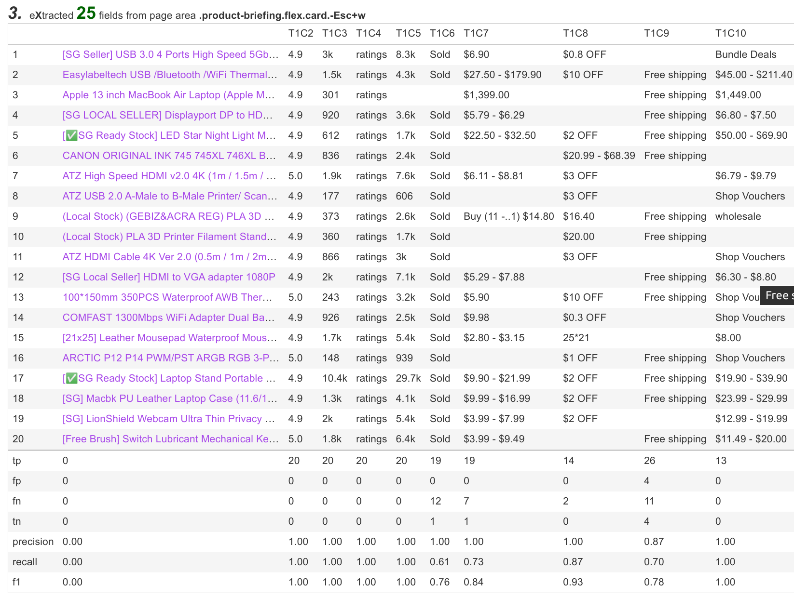

= Exotic README

link:README.adoc[English] | 简体中文 | https://gitee.com/platonai_galaxyeye/exotic[中国镜像]

Exotic (代表奇异之星 - Exotic Star) 是 PulsarR 的专业版，包含升级后的 PulsarR 服务器、一组顶级电商站点抓取实例、高级 AI 支持的自动提取小程序。

*#不用再写爬虫了。Exotic 从网站学习，自动生成所有提取规则，将 Web 当作数据库进行查询，完整精确地交付规模化的 Web 数据：#*

. 步骤1：使用高级人工智能自动提取网页中的每个字段，并生成提取 SQL
. 步骤2：测试 SQL，并在必要时改进它们以匹配前端业务需求
. 步骤3：在 Web 控制台中创建调度规则，以连续运行 SQL 并下载所有 Web 数据，从而推动您的业务向前发展

最受欢迎的网站已经有几十个 link:exotic-app/exotic-examples/src/main/kotlin/ai/platon/exotic/examples/sites/[采集案例]，我们正在不断增加更多的案例。

== 主要特性

* 网络爬虫：各种数据采集模式，包括浏览器渲染、ajax数据采集、普通协议采集等
* RPA：机器人流程自动化、模仿人类行为、采集单网页应用程序或执行其他有价值的任务
* 简洁的 API：一行代码抓取，或者一条 SQL 将整个网站栏目变成表格
* X-SQL：扩展 SQL 来管理 Web 数据：网络爬取、数据采集、Web 内容挖掘、Web BI
* Web UI：一个非常简单但功能强大的 Web UI，用于管理爬虫规则并下载数据
* 机器学习：使用自监督的机器学习自动提取网页中的每个字段，并生成提取规则和SQL
* 爬虫隐身：浏览器驱动隐身，IP 轮换，隐私上下文轮换，永远不会被屏蔽
* 高性能：高度优化，单机并行渲染数百页而不被屏蔽
* 低成本：每天抓取 100,000 个浏览器渲染的电子商务网页，或 n * 10,000,000 个数据点，仅需要 8 核 CPU/32G 内存
* 数据质量保证：智能重试、精准调度、Web 数据生命周期管理
* 大规模采集：完全分布式，专为大规模数据采集而设计
* 大数据支持：支持各种后端存储：本地文件/MongoDB/HBase/Gora
* 日志和指标：密切监控并记录每个事件
* [即将发布] Information Extraction：自动学习网页数据模式，以显著的精度自动提取网页中的每一个字段

== 系统要求

* Memory 4G+
* Maven 3.2+
* Java 11 JDK 最新版本
* java and jar on the PATH
* Google Chrome 90+

== 下载
下载最新的可执行 jar 包：
[source,bash]
----
wget http://static.platonic.fun/repo/ai/platon/exotic/exotic-standalone.jar
----

== 从源代码构建

如果 maven 版本号是 3.8.1 或以上，需要在 .m2/settings.xml 文件中加入如下代码：

[source,xml]
----
<mirrors>
    <mirror>
        <id>maven-default-http-blocker</id>
        <mirrorOf>dummy</mirrorOf>
        <name>Dummy mirror to override default blocking mirror that blocks http</name>
        <url>http://0.0.0.0/</url>
    </mirror>
</mirrors>
----

[source,bash]
----
git clone https://github.com/platonai/exotic.git
cd exotic
mvn clean && mvn
cd exotic-standalone/target/
----

== 运行独立服务器并打开 Web 控制台
[source,bash]
----
# Linux:
java -jar exotic-standalone*.jar serve

# Windows:
java -jar exotic-standalone[-the-actual-version].jar serve
----

注意:如果您在 Windows 上使用 CMD 或 PowerShell，您可能需要删除通配符 `*` 并使用 jar 包的全名。

如果 Exotic 在 GUI 模式下运行，Web 控制台应该在几秒钟内打开，或者您可以手动打开它：

http://localhost:2718/exotic/crawl/

== 执行自动提取

我们可以使用 `harvest` 命令，使用无监督的机器学习从一组项目页面中学习：

[source,bash]
----
java -jar exotic-standalone*.jar harvest https://shopee.sg/Computers-Peripherals-cat.11013247 -diagnose -refresh
----

上面命令中的URL应该是一个门户URL，比如产品列表页面的URL。

Exotic 访问入口网址，找出最佳的项目网页链接集，获取项目网页，然后从中学习。

下面是一个电子商务网站使用无监督机器学习自动提取结果的快照：

每个字段的最佳 CSS 选择器都是自动生成的，您可以以传统方式使用这些规则进行 Web 抓取：

image::docs/shopee.generated.selectors.png[Auto Generated Selectors]

以及生成的SQL：

image::docs/shopee.generated.sql.png[Auto Generated SQL]

请注意，本演示中的网站使用了 CSS 混淆技术，因此 CSS 选择器很难阅读并且经常改变。除了基于机器学习的解决方案之外，没有其他有效的技术来解决这个问题。

完整的代码可以在 link:exotic-app/exotic-ML-examples/src/main/kotlin/ai/platon/exotic/examples/sites/topEc/english/shopee/ShopeeHarvester.kt[这里] 找到。

== 使用生成的SQL抓取页面：

`Harvest` 命令使用无监督的机器学习自动提取字段，并为所有可能的字段和提取SQL生成最佳 css 选择器。我们可以使用 `sql` 命令来执行 SQL。

[source,bash,sql]
----
# Note: remove the wildcard `*` and use the full name of the jar on Windows
java -jar exotic-standalone*.jar sql "
select
    dom_first_text(dom, 'div.-Esc+w.card.product-briefing div.HLQqkk div.flex-column.imEX5V span') as T1C2,
    dom_first_text(dom, 'div.HLQqkk div.flex-column.imEX5V div.W2tD8- div.MrYJVA.Ga-lTj') as T1C3,
    dom_first_text(dom, 'div.HLQqkk div.flex-column.imEX5V div.W2tD8- div.MrYJVA') as T1C4,
    dom_first_text(dom, 'div.HLQqkk div.flex-column.imEX5V div.W2tD8- div.Wz7RdC') as T1C5,
    dom_first_text(dom, 'div.HLQqkk div.flex-column.imEX5V div.W2tD8- div._45NQT5') as T1C6,
    dom_first_text(dom, 'div.HLQqkk div.flex-column.imEX5V div.W2tD8- div.Cv8D6q') as T1C7,
    dom_first_text(dom, 'div.-Esc+w.card.product-briefing div.HLQqkk div.imEX5V div.pmmxKx') as T1C8,
    dom_first_text(dom, 'div.-Esc+w.card.product-briefing div.HLQqkk div.imEX5V div.mini-vouchers__label') as T1C9,
    dom_first_text(dom, 'div.imEX5V div.PMuAq5 div.flex-no-overflow span.voucher-promo-value.voucher-promo-value--absolute-value') as T1C10,
    dom_first_text(dom, 'div.HLQqkk div.imEX5V div.PMuAq5 label._0b8hHE') as T1C11,
    dom_first_text(dom, 'div.PMuAq5 div.MGNOw3.hInOdW div.dHS5e4.xIMb1R div.LgUWja') as T1C12,
    dom_first_text(dom, 'div.PMuAq5 div.MGNOw3.hInOdW div.dHS5e4.xIMb1R div.Nd79Ux') as T1C13,
    dom_first_text(dom, 'div.MGNOw3.hInOdW div.dHS5e4.xIMb1R div.flex-row div.NPdOlf') as T1C14,
    dom_first_text(dom, 'div.imEX5V div.PMuAq5 div.-+gikn.hInOdW label._0b8hHE') as T1C15,
    dom_first_text(dom, 'div.PMuAq5 div.-+gikn.hInOdW div.items-center button.product-variation') as T1C16,
    dom_first_text(dom, 'div.PMuAq5 div.-+gikn.hInOdW div.items-center button.product-variation') as T1C17,
    dom_first_text(dom, 'div.imEX5V div.PMuAq5 div.-+gikn.hInOdW div._0b8hHE') as T1C18,
    dom_first_text(dom, 'div.PMuAq5 div.-+gikn.hInOdW div.G2C2rT.items-center div') as T1C19,
    dom_first_text(dom, 'div.flex-column.imEX5V div.vdf0Mi div.OozJX2 span') as T1C20,
    dom_first_text(dom, 'div.HLQqkk div.flex-column.imEX5V div.vdf0Mi button.btn.btn-solid-primary.btn--l.GfiOwy') as T1C21,
    dom_first_text(dom, 'div.-Esc+w.card.product-briefing div.HLQqkk div.flex-column.imEX5V span.zevbuo') as T1C22,
    dom_first_text(dom, 'div.-Esc+w.card.product-briefing div.HLQqkk div.flex-column.imEX5V span') as T1C23
from load_and_select('https://shopee.sg/(Local-Stock)-(GEBIZ-ACRA-REG)-PLA-3D-Printer-Filament-Standard-Colours-Series-1.75mm-1kg-i.182524985.8326053759?sp_atk=3afa9679-22cb-4c30-a1db-9d271e15b7a2&xptdk=3afa9679-22cb-4c30-a1db-9d271e15b7a2', 'div.page-product');
"
----

== 探索可执行 jar 包的其他能力

直接运行可执行的 jar 包来获得帮助，以探索所提供的更多功能：

[source,bash]
----
# Note: remove the wildcard `*` and use the full name of the jar on Windows
java -jar exotic-standalone*.jar
----
这个命令将打印帮助信息和最有用的例子。

== Q & A
Q: 如何使用代理？

A: 点击 link:bin/tools/proxy/README.adoc[这里] 查看。
