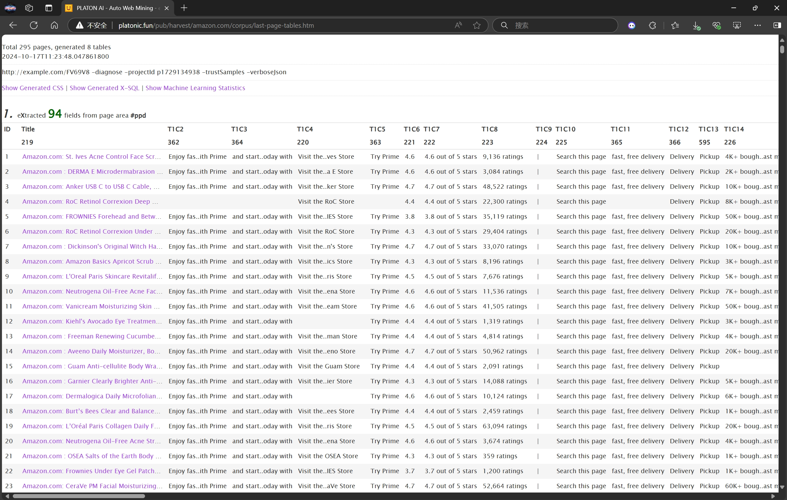

# PulsarRPAPro README

[English](README.md) | 简体中文 | [中国镜像](https://gitee.com/platonai_galaxyeye/exotic)



PulsarRPAPro 包含升级的服务器、一组顶级电商网站抓取示例，以及由高级 AI 支持的自动提取小程序。

**再也不用编写网页抓取器。PulsarRPAPro 从网站中学习，并大规模地完全准确地交付网页数据。**

目前已经为最受欢迎的网站提供了数十个链接：[抓取案例](exotic-app/exotic-examples/src/main/kotlin/ai/platon/exotic/examples/sites/)，我们不断添加更多案例。

## 特性

- 自动提取网页数据
- 网络爬虫：浏览器渲染、AJAX 数据抓取
- 高性能：高度优化，在单台机器上并行渲染数百个页面而不被阻塞
- 低成本：抓取 100,000 个浏览器渲染的电商网页，或每天抓取 n * 10,000,000 个数据点，仅需 8 核 CPU/32G 内存
- 网页 UI：一个非常简单但功能强大的网页 UI 来管理爬虫和下载数据
- 机器学习：使用无监督机器学习自动提取网页中的每个字段，并生成提取规则和 SQL
- 数据量保证：智能重试、精准调度、网页数据生命周期管理
- 大规模：完全分布式设计，适用于大规模抓取
- 简单 API：一行代码抓取，或一条 SQL 将网站转换为表格
- X-SQL：扩展 SQL 管理网页数据：网页抓取、抓取、网页内容挖掘、网页 BI
- 机器人隐身：IP 轮换、WebDriver 隐身，永不被封禁
- RPA：模拟人类行为、SPA 抓取，或做其他酷炫的事情
- 大数据：支持多种后端存储：MongoDB/HBase/Gora
- 日志与指标：密切监控，每个事件都被记录

## System Requirements

- Memory 4G+
- The latest version of the Java 11 JDK
- Java and jar on the PATH
- Google Chrome 90+
- MongoDB started

## Download & Run

下载最新可执行的 JAR 文件：

```bash
wget http://static.platonic.fun/repo/ai/platon/exotic/PulsarRPAPro.jar
# start mongodb
docker-compose -f docker/docker-compose.yaml up
java -jar PulsarRPAPro.jar
java -jar PulsarRPAPro.jar harvest "https://www.amazon.com/b?node=1292115011" -diagnose -refresh
```

## Build from source

将以下行添加到您的 `.m2/settings.xml` 文件中。

```xml
<mirrors>
    <mirror>
        <id>maven-default-http-blocker</id>
        <mirrorOf>dummy</mirrorOf>
        <name>Dummy mirror to override default blocking mirror that blocks http</name>
        <url>http://0.0.0.0/</url>
    </mirror>
</mirrors>
```

```bash
git clone https://github.com/platonai/exotic.git
cd exotic
mvn clean && mvn
cd exotic-standalone/target/

# Don't forget to start MongoDB
docker-compose -f docker/docker-compose.yaml up
```

对于中国开发者，我们强烈建议您遵循[此](https://github.com/platonai/pulsarr/blob/master/bin/tools/maven/maven-settings.adoc)指南以加速构建过程。

## Run the standalone server and open web console

```bash
java -jar PulsarRPAPro.jar serve
```

如果 Exotic 以 GUI 模式运行，网页控制台应在几秒钟内自动打开，或者您可以手动打开它：

http://localhost:2718/exotic/crawl/

## Run Auto Extraction

我们可以使用 `harvest` 命令通过无监督机器学习从一组商品页面中学习。

```bash
java -jar PulsarRPAPro.jar harvest "https://www.amazon.com/b?node=1292115011" -diagnose -refresh
```

上述命令中的 URL 应该是一个门户 URL，例如产品列表页面的 URL。

Exotic 访问门户 URL，找到最适合商品页面的最佳链接集，抓取商品页面，然后从中学习。

以下是自动提取结果的整个 HTML 页面：

[亚马逊自动提取结果](docs/amazon-harvest-result.html)

## Explore the Exotic executable jar

直接运行可执行的 JAR 文件以获取帮助，探索更多提供的功能：

```bash
java -jar PulsarRPAPro.jar
```

此命令将打印帮助消息和最常用的示例。

## Q & A

**Q: 如何使用代理 IP?**

A: 遵循[此](bin/tools/proxy/README.adoc)指南进行代理轮换。
