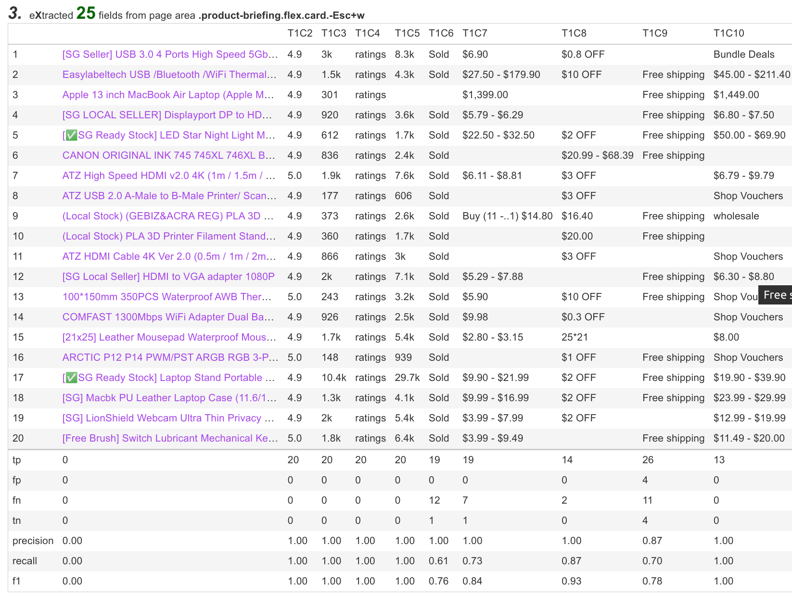
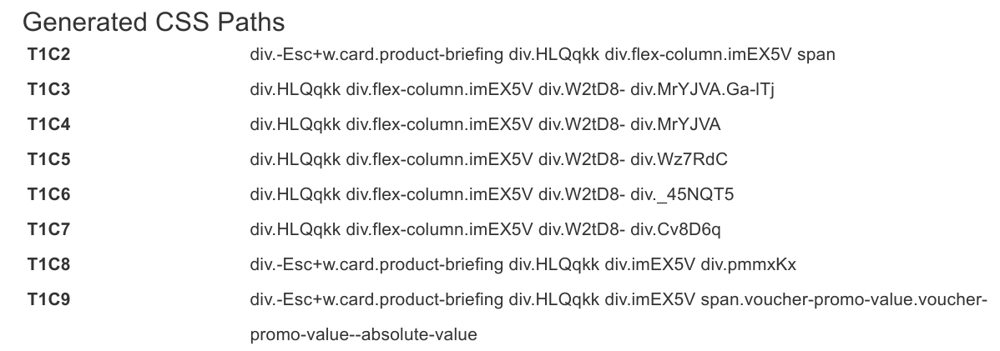
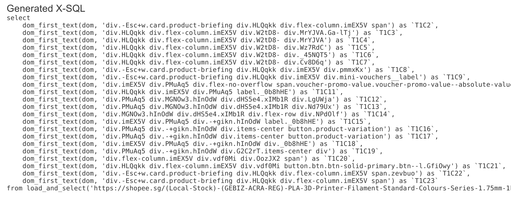

= Exotic README

Exotic (stand for exotic star) is the professional edition of Pulsar with advanced AI support to do link:exotic-app/exotic-ML-examples/src/main/kotlin/ai/platon/exotic/examples/sites/[Auto Extract].

*#Never write another web scraper. Exotic learns from the website, automatically generates all the extract rules, queries the Web as a database, and delivers web data completely and accurately at scale:#*

. STEP1: automatically extract every field in webpages using advanced AI and generate extract SQLs
. STEP2: test the SQLs and improve them to match frontend business requirements if necessary
. STEP3: create crawl rules in the web console to run extract SQLs continuously and download all the web data to drive your business forward

Exotic also demonstrates:

* How to use Pulsar as a library

There are already dozens of link:exotic-app/exotic-examples/src/main/kotlin/ai/platon/exotic/examples/sites/[scraping cases] for the most popular websites, we are constantly adding more cases.

== Features

* Web spider: browser rendering, ajax data crawling
* High performance: highly optimized, rendering hundreds of pages in parallel on a single machine without be blocked
* Low cost: scraping 100,000 browser rendered e-comm webpages, or n * 10,000,000 data point each day, only 8 core CPU/32G memory are required
* Web UI: a very simple yet powerful web UI to manage spiders and download data
* Machine learning: automatically extract every field in webpages using unsupervised machine learning and generate extract rules and SQLs
* Data quantity assurance: smart retry, accurate scheduling, web data lifecycle management
* Large scale: fully distributed, designed for large scale crawling
* Simple API: single line of code to scrape, or single SQL to turn a website into a table
* X-SQL: extended SQL to manage web data: Web crawling, scraping, Web content mining, Web BI
* Bot stealth: IP rotation, web driver stealth, never get banned
* RPA: simulating human behaviors, SPA crawling, or do something else awesome
* Big data: various backend storage support: MongoDB/HBase/Gora
* Logs &amp; metrics: monitored closely and every event is recorded

== Requirements

* Memory 4G+
* The latest version of the Java 11 JDK
* Java and jar on the PATH
* Google Chrome 90+

== Download
Download the latest executable jar:
[source,bash]
----
wget http://static.platonic.fun/repo/ai/platon/exotic/exotic-standalone.jar
----

== Build from source
[source,bash]
----
git clone https://github.com/platonai/exotic.git
cd exotic
mvn clean && mvn
cd exotic-standalone/target/
----

== Run the standalone server and open web console
[source,bash]
----
java -jar exotic-standalone*.jar serve
----

Note: if you are using CMD or PowerShell on Windows, you may need to remove the wildcard `*` and use the full name of the jar.

If Exotic is running in GUI mode, the web console should open within a few seconds, or you can open it manually:

http://localhost:2718/exotic/crawl/

== Run Auto Extract

We can use the `harvest` command to leans from a set of item pages using unsupervised machine learning.

[source,bash]
----
java -jar exotic-standalone*.jar harvest https://shopee.sg/Computers-Peripherals-cat.11013247 -diagnose -refresh
----

The URL in the command above should be an portal URL, such as the URL of the product listing page.

Exotic visits the portal URL, finds out the best link set for item pages, fetches item pages and then learn from them.

Here is a snapshot of the result of auto extract using unsupervised machine learning for an e-comm site.

The best CSS selectors for each field are generated automatically, you can use these rules for web scraping in the old-fashioned way:

And also the generated SQL:

Note that the website in this demo uses CSS obfuscation techniques, so the CSS selectors are hard to read and changes frequently. There is no other effective technology to solve this problem other than machine learning based solutions.

The complete code can be found link:exotic-app/exotic-ML-examples/src/main/kotlin/ai/platon/exotic/examples/sites/topEc/english/shopee/ShopeeHarvester.kt[here].

== Scrape pages using the generated SQLs
The `harvest` command extracts fields automatically using unsupervised machine learning, and also generates the best css selectors for all possible fields and the extract SQLs. We can execute the SQLs using `sql` command.
[source,bash,sql]
----
# Note: remove the wildcard `*` and use the full name of the jar on Windows
java -jar exotic-standalone*.jar sql "
select
    dom_first_text(dom, 'div.-Esc+w.card.product-briefing div.HLQqkk div.flex-column.imEX5V span') as T1C2,
    dom_first_text(dom, 'div.HLQqkk div.flex-column.imEX5V div.W2tD8- div.MrYJVA.Ga-lTj') as T1C3,
    dom_first_text(dom, 'div.HLQqkk div.flex-column.imEX5V div.W2tD8- div.MrYJVA') as T1C4,
    dom_first_text(dom, 'div.HLQqkk div.flex-column.imEX5V div.W2tD8- div.Wz7RdC') as T1C5,
    dom_first_text(dom, 'div.HLQqkk div.flex-column.imEX5V div.W2tD8- div._45NQT5') as T1C6,
    dom_first_text(dom, 'div.HLQqkk div.flex-column.imEX5V div.W2tD8- div.Cv8D6q') as T1C7,
    dom_first_text(dom, 'div.-Esc+w.card.product-briefing div.HLQqkk div.imEX5V div.pmmxKx') as T1C8,
    dom_first_text(dom, 'div.-Esc+w.card.product-briefing div.HLQqkk div.imEX5V div.mini-vouchers__label') as T1C9,
    dom_first_text(dom, 'div.imEX5V div.PMuAq5 div.flex-no-overflow span.voucher-promo-value.voucher-promo-value--absolute-value') as T1C10,
    dom_first_text(dom, 'div.HLQqkk div.imEX5V div.PMuAq5 label._0b8hHE') as T1C11,
    dom_first_text(dom, 'div.PMuAq5 div.MGNOw3.hInOdW div.dHS5e4.xIMb1R div.LgUWja') as T1C12,
    dom_first_text(dom, 'div.PMuAq5 div.MGNOw3.hInOdW div.dHS5e4.xIMb1R div.Nd79Ux') as T1C13,
    dom_first_text(dom, 'div.MGNOw3.hInOdW div.dHS5e4.xIMb1R div.flex-row div.NPdOlf') as T1C14,
    dom_first_text(dom, 'div.imEX5V div.PMuAq5 div.-+gikn.hInOdW label._0b8hHE') as T1C15,
    dom_first_text(dom, 'div.PMuAq5 div.-+gikn.hInOdW div.items-center button.product-variation') as T1C16,
    dom_first_text(dom, 'div.PMuAq5 div.-+gikn.hInOdW div.items-center button.product-variation') as T1C17,
    dom_first_text(dom, 'div.imEX5V div.PMuAq5 div.-+gikn.hInOdW div._0b8hHE') as T1C18,
    dom_first_text(dom, 'div.PMuAq5 div.-+gikn.hInOdW div.G2C2rT.items-center div') as T1C19,
    dom_first_text(dom, 'div.flex-column.imEX5V div.vdf0Mi div.OozJX2 span') as T1C20,
    dom_first_text(dom, 'div.HLQqkk div.flex-column.imEX5V div.vdf0Mi button.btn.btn-solid-primary.btn--l.GfiOwy') as T1C21,
    dom_first_text(dom, 'div.-Esc+w.card.product-briefing div.HLQqkk div.flex-column.imEX5V span.zevbuo') as T1C22,
    dom_first_text(dom, 'div.-Esc+w.card.product-briefing div.HLQqkk div.flex-column.imEX5V span') as T1C23
from load_and_select('https://shopee.sg/(Local-Stock)-(GEBIZ-ACRA-REG)-PLA-3D-Printer-Filament-Standard-Colours-Series-1.75mm-1kg-i.182524985.8326053759?sp_atk=3afa9679-22cb-4c30-a1db-9d271e15b7a2&xptdk=3afa9679-22cb-4c30-a1db-9d271e15b7a2', 'div.page-product');
"
----

== Explore the Exotic executable jar
Run the executable jar directly for help to explore more power provided:
[source,bash]
----
# Note: remove the wildcard `*` and use the full name of the jar on Windows
java -jar exotic-standalone*.jar
----
This command will print the help message and most useful examples.

== Q & A
Q: How to use proxies?

A: Follow link:bin/tools/proxy/README.adoc[this] guide for proxy rotation.
