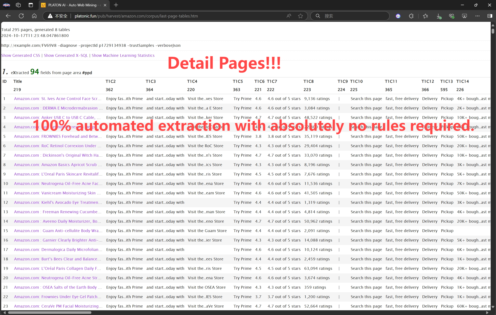

= PulsarRPAPro README

English | link:README-CN.adoc[简体中文] | https://gitee.com/platonai_galaxyeye/exotic[中国镜像]

PulsarRPAPro is the professional version of PulsarRPA, featuring an upgraded server, a collection of top e-commerce site scraping examples, and an advanced AI-powered applet for automatic data extraction.

*#Never write another web scraper. PulsarRPAPro learns from the website and delivers web data completely and accurately at scale#*

There are already dozens of link:exotic-app/exotic-examples/src/main/kotlin/ai/platon/exotic/examples/sites/[scraping cases] for the most popular websites, we are constantly adding more cases.

== Youtube

== Features

* Extract Web Data Automatically
* Web spider: browser rendering, ajax data crawling
* High performance: highly optimized, rendering hundreds of pages in parallel on a single machine without be blocked
* Low cost: scraping 100,000 browser rendered e-comm webpages, or n * 10,000,000 data point each day, only 8 core CPU/32G memory are required
* Web UI: a very simple yet powerful web UI to manage spiders and download data
* Machine learning: automatically extract every field in webpages using unsupervised machine learning and generate extract rules and SQLs
* Data quantity assurance: smart retry, accurate scheduling, web data lifecycle management
* Large scale: fully distributed, designed for large scale crawling
* Simple API: single line of code to scrape, or single SQL to turn a website into a table
* X-SQL: extended SQL to manage web data: Web crawling, scraping, Web content mining, Web BI
* Bot stealth: IP rotation, web driver stealth, never get banned
* RPA: simulating human behaviors, SPA crawling, or do something else awesome
* Big data: various backend storage support: MongoDB/HBase/Gora
* Logs &amp; metrics: monitored closely and every event is recorded

== System Requirements

* Memory 4G+
* The latest version of the Java 17 JDK
* Latest Google Chrome
* MongoDB started

== Download & Run
Download the latest executable jar:
[source,bash]
----
wget http://static.platonic.fun/repo/ai/platon/exotic/PulsarRPAPro.jar
# start mongodb
docker-compose -f docker/docker-compose.yaml up
java -jar PulsarRPAPro.jar
java -jar PulsarRPAPro.jar harvest "https://www.amazon.com/b?node=1292115011" -diagnose -refresh
----

== Build from source

Add the following lines to your .m2/settings.xml.

[source,xml]
----
<mirrors>
    <mirror>
        <id>maven-default-http-blocker</id>
        <mirrorOf>dummy</mirrorOf>
        <name>Dummy mirror to override default blocking mirror that blocks http</name>
        <url>http://0.0.0.0/</url>
    </mirror>
</mirrors>
----

[source,bash]
----
git clone https://github.com/platonai/exotic.git
cd exotic
mvn clean && mvn
cd exotic-standalone/target/

# Don't forget to start MongoDB
docker-compose -f docker/docker-compose.yaml up
----
For Chinese developers, we strongly suggest that you follow link:https://github.com/platonai/pulsarr/blob/master/bin/tools/maven/maven-settings.adoc[this] instruction to accelerate the building.

== Run the standalone server and open web console
[source,bash]
----
java -jar PulsarRPAPro.jar serve
----

If PulsarRPAPro is running in GUI mode, the web console should open within a few seconds, or you can open it manually:

http://localhost:2718/exotic/crawl/

== Run Auto Extraction

We can use the `harvest` command to leans from a set of item pages using unsupervised machine learning.

[source,bash]
----
java -jar PulsarRPAPro.jar harvest "https://www.amazon.com/b?node=1292115011" -diagnose -refresh
----

The URL specified in the command should be a portal URL, such as a product listing page URL.

PulsarRPAPro will visit the portal, identify the optimal set of links for item pages, retrieve those pages, and then analyze them.

Below is a snapshot of the results from automatic extraction using unsupervised machine learning on an e-commerce site.

Here is the whole page of the auto extraction result in HTML format:

link:docs/amazon-harvest-result.html[Auto Extraction Result of Amazon]

== Explore the PulsarRPAPro executable jar
Run the executable jar directly for help to explore more power provided:
[source,bash]
----
# Note: remove the wildcard `*` and use the full name of the jar on Windows
java -jar PulsarRPAPro.jar
----
This command will print the help message and most useful examples.

== Q & A
Q: How to use proxies?

A: Follow link:bin/tools/proxy/README.adoc[this] guide for proxy rotation.
