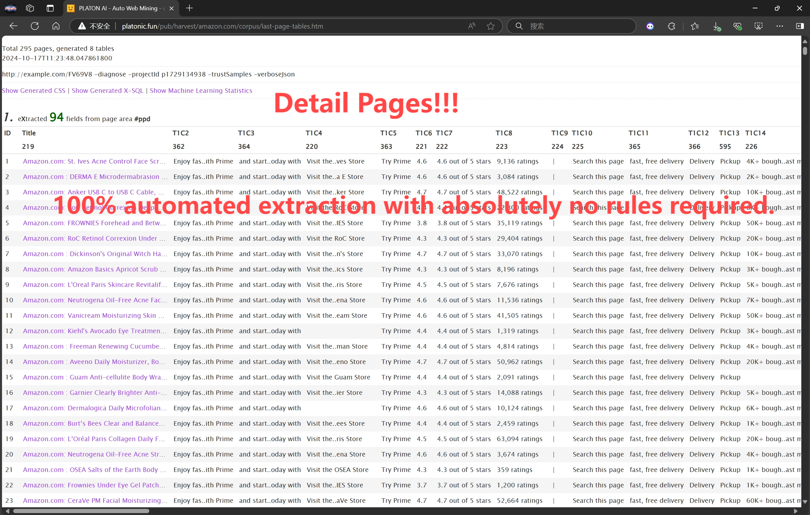

# 🚀 PulsarRPAPro

**English** | [简体中文](README-CN.md) | [中国镜像 🇨🇳](https://gitee.com/platonai_galaxyeye/exotic)

💖 PulsarRPAPro: The AI-Powered, Lightning-Fast Browser Automation Solution! 💖

---

# 🌟 Key Features

**Core Capabilities of PulsarRPAPro:**

* 👽 **AutoExtract**

  * 🤖 Powered by machine learning agents — no token cost!
    * 🎯 High-precision data extraction
    * 🏃‍♂️ Blazing fast performance

* 🌐 **Web UI** — Intuitive and easy to use

* ⌨️ **Command Line Interface (CLI)** — Scriptable and automation-ready

**Advanced Features Included:**

* 🤖 **AI Integration with LLMs** — Smarter automation driven by large language models
* ⚡ **Ultra-Fast Automation** — Coroutine-safe browser concurrency with spider-grade crawling speed
* 🧠 **Deep Web Understanding** — Intelligent parsing of dynamic, JavaScript-rich pages
* 📊 **Structured Data APIs** — Extract clean, structured data with minimal effort

---

🤖 Automate the browser and extract data at scale with simple text:

```text
Go to https://www.amazon.com/dp/B0C1H26C46
After page load: scroll to the middle.

Summarize the product.
Extract: product name, price, ratings.
Find all links containing /dp/.
```

---

👽 Extract data with machine learning agents:



---

# 🎥 Demo Videos

* **YouTube**:
  [](https://www.youtube.com/watch?v=qoXbnL4wdtc)

* **Bilibili**:
  [https://www.bilibili.com/video/BV1Qg4y1d7kA](https://www.bilibili.com/video/BV1Qg4y1d7kA)

---

# 🚀 Quick Start Guide

## ▶️ Run PulsarRPAPro

### 📦 Run Executable Jar - Enjoy the Best Experience

Executable JAR uses your desktop browser, you can enjoy the best experience.

Download:

```bash
# Linux/macOS and Windows (if curl is available)
curl -L -o PulsarRPAPro.jar https://platonai.cn/pub/repo/ai/platon/exotic/PulsarRPAPro.jar
```

Run the JAR for help:

```bash
  java -jar PulsarRPAPro.jar
```

<details>
<summary>📂 Resources</summary>

* 🟦 [GitHub Release Download](https://github.com/platonai/PulsarRPA/releases/download/v3.1.0/PulsarRPA.jar)
* 📁 [Mirror / Backup Download](https://platonai.cn/pub/repo/ai/platon/pulsar/)
* 🛠️ [LLM Configuration Guide](docs/config/llm/llm-config.md)
* 🛠️ [Configuration Guide](docs/config.md)

</details>

### ⚙️ Prerequisites

MongoDB running on port 27017 without authentication:

<details>

```bash
  docker run -d --name mongodb -p 27017:27017 mongo:latest
```

</details>

### 🐳 Docker Users

Docker user can run the Docker image directly:

<details>

```shell
  docker run -d -p 8182:8182 -e DEEPSEEK_API_KEY=${DEEPSEEK_API_KEY} galaxyeye88/pulsar-rpa-pro:latest
```

</details>


---

# 📚 Auto Extraction Guide: Just Structured Data! No Code! No Token!

Use the `harvest` command to extract data from a product listing using unsupervised ML:

```bash
java -jar PulsarRPAPro.jar harvest "https://www.amazon.com/b?node=1292115011" -diagnose -refresh
```

<details>

> 💡 Make sure the URL is a portal page like a product category or listing.

The tool will:

1. Visit the portal
2. Identify optimal item page links
3. Retrieve those pages
4. Analyze them automatically

### 📄 Example Results

See a sample extraction result in HTML:
[Auto Extraction Result of Amazon](docs/assets/amazon-harvest-result.html)

</details>

---

# 🖥️ Run PulsarRPAPro Server

```bash
  java -DDEEPSEEK_API_KEY=${DEEPSEEK_API_KEY} -jar PulsarRPAPro.jar serve
```

---

# 🧠 LLM Capabilities: Just Text, No Code!

Use the `ai/command` API to perform actions and extract data using natural language instructions.

```bash
curl -X POST "http://localhost:8182/api/ai/command" \
  -H "Content-Type: text/plain" \
  -d '
    Visit https://www.amazon.com/dp/B0C1H26C46
    Summarize the product.
    Extract: product name, price, ratings.
    Find all links containing /dp/.
    After page load: click #title, then scroll to the middle.
  '
```

---

# 🔍 LLM + X-SQL: Precise, Flexible, Powerful

Harness the power of the `x/e` API for highly precise, flexible, and intelligent data extraction.

```bash
curl -X POST "http://localhost:8182/api/x/e" -H "Content-Type: text/plain" -d "
select
  llm_extract(dom, 'product name, price, ratings') as llm_extracted_data,
  dom_base_uri(dom) as url,
  dom_first_text(dom, '#productTitle') as title,
  dom_first_slim_html(dom, 'img:expr(width > 400)') as img
from load_and_select('https://www.amazon.com/dp/B0C1H26C46', 'body');
"
```

🔎 Sample Output:

```json
{
  "llm_extracted_data": {
    "product name": "Apple iPhone 15 Pro Max",
    "price": "$1,199.00",
    "ratings": "4.5 out of 5 stars"
  },
  "url": "https://www.amazon.com/dp/B0C1H26C46",
  "title": "Apple iPhone 15 Pro Max",
  "img": ""
}
```

---

# 🔧 Proxies - Unlock Advanced Capabilities

<details>

Set the environment variable:

```bash
export PROXY_ROTATION_URL=https://your-proxy-provider.com/rotation-endpoint
```

This URL should return fresh proxy IPs when accessed.

</details>

---

# 📞 Contact Us

* 💬 **WeChat**: galaxyeye
* 🌐 **Weibo**: [galaxyeye](https://weibo.com/galaxyeye)
* 📧 **Email**: [galaxyeye@live.cn](mailto:galaxyeye@live.cn), [ivincent.zhang@gmail.com](mailto:ivincent.zhang@gmail.com)
* 🐦 **Twitter**: [@galaxyeye8](https://twitter.com/galaxyeye8)
* 🌍 **Website**: [platon.ai](https://platon.ai)

<div style="display: flex;">
  
</div>
